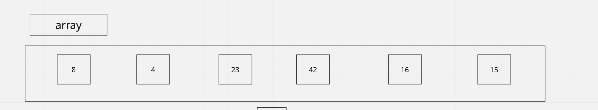
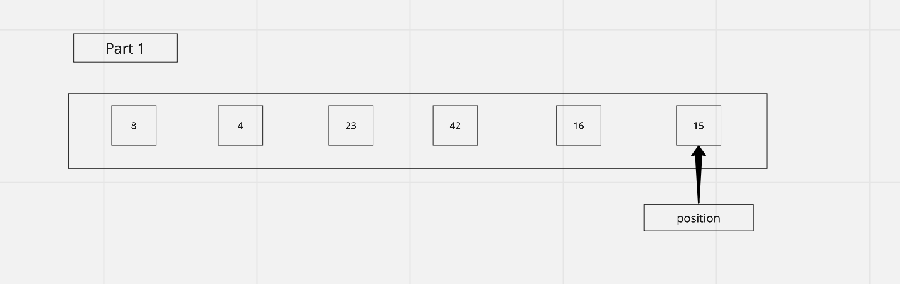
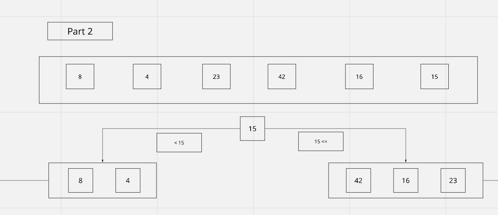
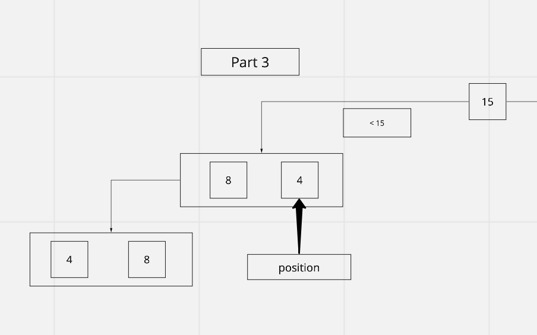
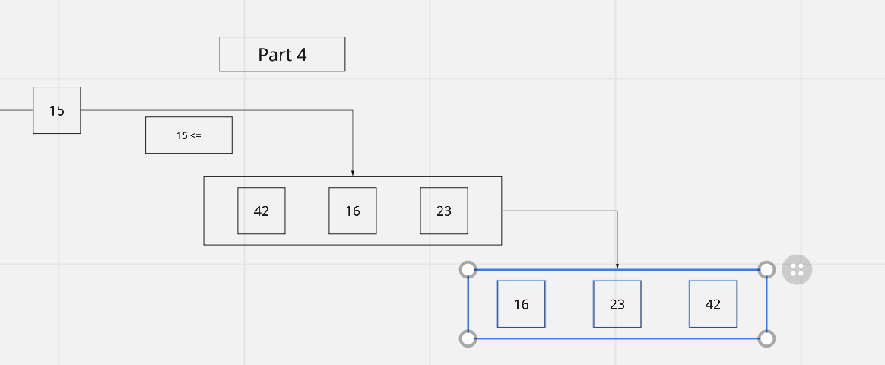
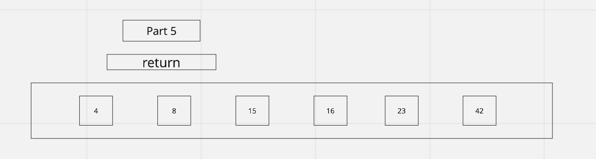

# Quick Sort

Insertion Sort is a function that takes in an array, and transverses through each number, sorting the array in ascending order. If the current value is smaller than the previous value then the previous value takes over the current values position, and moves up the array. It continues until the entire array is sorted.

## Pseudocode

```
ALGORITHM QuickSort(arr, left, right)
if left < right
// Partition the array by setting the position of the pivot value
DEFINE position <-- Partition(arr, left, right)
// Sort the left
QuickSort(arr, left, position - 1)
// Sort the right
QuickSort(arr, position + 1, right)

ALGORITHM Partition(arr, left, right)
// set a pivot value as a point of reference
DEFINE pivot <-- arr[right]
// create a variable to track the largest index of numbers lower than the defined pivot
DEFINE low <-- left - 1
for i <- left to right do
if arr[i] <= pivot
low++
Swap(arr, i, low)

     // place the value of the pivot location in the middle.
     // all numbers smaller than the pivot are on the left, larger on the right.
     Swap(arr, right, low + 1)
    // return the pivot index point
     return low + 1

ALGORITHM Swap(arr, i, low)
DEFINE temp;
temp <-- arr[i]
arr[i] <-- arr[low]
arr[low] <-- temp

use as your sample array & testing.
[8,4,23,42,16,15]

```

## Starting array:



Pass 1:


Pass 1  
 We first determine the position of our we will use as a pivot point for the swap. This function will iterate through the array until it reaches the first value that is greater than our value at the end of our array. This value will become the `Pivot Point` -> I.E our `Position`.

Pass 2:

  
Pass 2 of

I have broken this array into sections for ease of viewing but essentially given the `Position` calculated in part 1, the function will take the swap point, I.E the `Pivot Point` and cwap the values to the left and right of this value accordingly, starting with the index points to the `left` of the `Pivot`.

Pass 3:

  
Pass 3

    The function then 'partition()' again to calculate the `Pivot Point` of the `Index` values less than our origional Position calculated in step 1. From here the function will get the position of 4 and check if the value of 8 < 4. Since this is not the case we will break the `if()` inside the `for()` and swap the positions of 8 -> 4.

Pass 4:

  
Pass 4

Now the function will take the array with the values of `Position -1` swapped and perform the same `quickSort()` but this time for `position + 1`. We will get our new Pivot point of 16. We will perform the `swap()` until the array is sorted.

  
Pass 5

    Lastly we will return our newly sorted array.

## Efficency

Time: O(n)  
Determined by the length of the array.
Space: O(lgn)
becomes less complex as we sort the array
