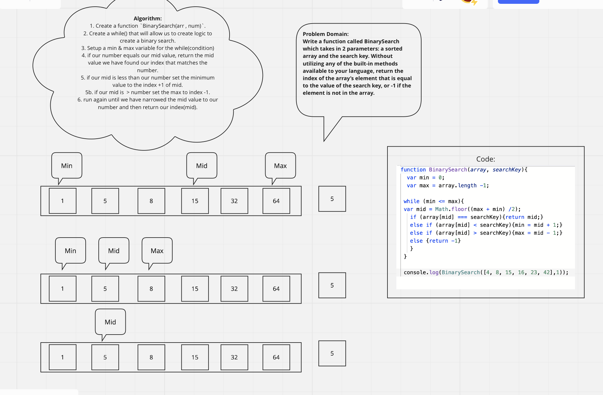

# Insert Shift Array

### Feature Tasks

Write a function called `BinarySearch` which takes in 2 parameters: a sorted array and the search key. Without utilizing any of the built-in methods available to your language, return the index of the array’s element that is equal to the value of the search key, or -1 if the element is not in the array.

### Expected Output

`Input`  
[4, 8, 15, 16, 23, 42], 15  
[-131, -82, 0, 27, 42, 68, 179], 42  
[11, 22, 33, 44, 55, 66, 77], 90  
[1, 2, 3, 5, 6, 7], 4  
`Output`  
2  
4  
-1  
-1

## WhiteBoard Process

;
