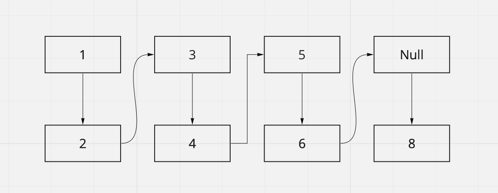

# Implementation: Linked-list-insertion

## Approach & Efficiency

<!-- What approach did you take? Why? What is the Big O space/time for this approach? -->

Constant Complexity O(1) for .insert\
Linear Complexity O(n) for .includes\

## API

### Feature Task\

Write a function called zip lists\
Arguments: 2 linked lists\
Return: Linked List, zipped as noted below\
Zip the two linked lists together into one so that the nodes alternate between the two lists and return a reference to the head of the zipped list.\
Try and keep additional space down to O(1)\
You have access to the Node class and all the properties on the Linked List class as well as the methods created in previous challenges.\

## Specifications

Read all of these instructions carefully.
Name things exactly as described.
Do all your work in a your `data-structures-and-algorithms public` repository.
Create a new branch in your repo named as noted below.
Follow the language-specific instructions for the challenge type listed below.
Update the “Table of Contents” - in the README at the root of the repository - with a link to this challenge’s README file.

## Challenge Setup & Execution

Branch Name: linked-list-zip\

Challenge Type: Code Challenge / Algorithm

;

Features\
`Node`

## Structure and Testing

Zip -> "Alternates between lList1 & lList2 merging values"
