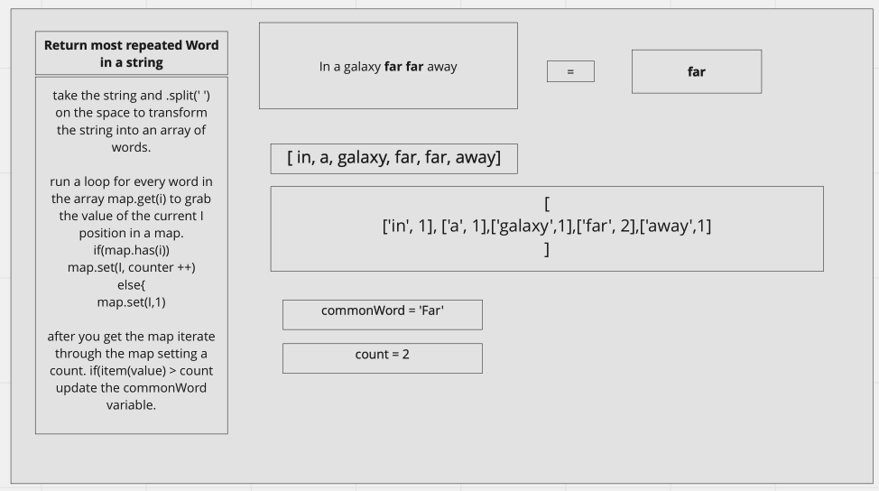

# Implementation: k-ary tree -> FizzBuzz

```
Write a function that given a string returns the most common word expressed in said input string

```

## Approach & Efficiency

<!-- What approach did you take? Why? What is the Big O space/time for this approach? -->

### BIG-O:

```
Time: O(n);
Space: linear O(n);

```

;

## API

## Features

```
Determine the most common word in a book.
```

```
Input:                                     OutPut:
In a galaxy far far away	                    far
Taco cat ate a taco	taco                     taco
No. Try not. Do or do not. There is no try.	  No

```

## Specifications

```
Read all of the following instructions carefully.
Act as an interviewer, giving a candidate a code challenge
Score the candidate according to the Whiteboard Rubric
You are free to offer suggestions or guidance (and see how they respond), but don’t solve it for the candidate
```

## Challenge Setup & Execution

```
Branch Name: `commonWord`

Challenge Type: Code Challenge / Algorithm
```

## Testing

```
describe("Finding the most common word in a given string", () => {
  it("given a string return the most common word", () => {
    let str = "in a galaxy far far away";
    let str2 = "in a galaxy far far far away away away away";

    expect(commonWord(str)).toBe("far");
    expect(commonWord(str2)).toBe("away");
  });
});
```
